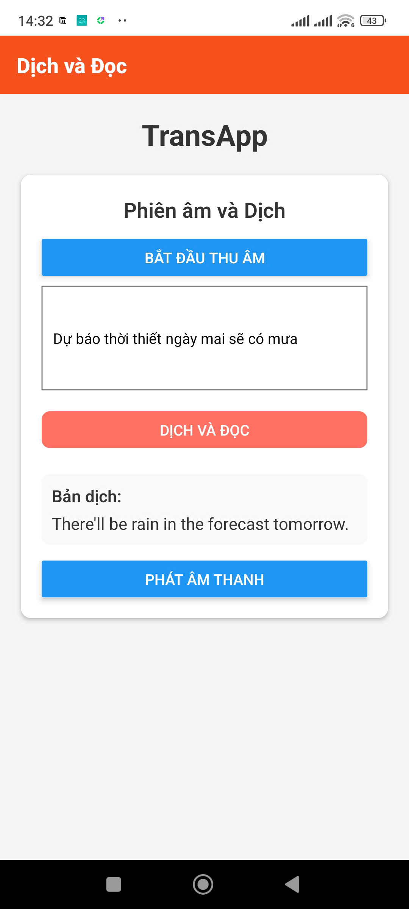

# Introduction  
Based on two pretrained models — **Phowhisper-small** and **opus-mmt-vi-en**, this project builds a mobile application for the **Android platform**. The backend is developed using **Django**, while the frontend uses **React Native** and **Node.js**. In addition, the project utilizes several supporting tools such as **Ngrok**, **Expo**, and **Firebase**.

# How the project currently works  

- **Backend**: The server runs on a local laptop. **Ngrok** is used to generate public URLs for the local port `8000`. This Ngrok URL is then added to **Firebase Console**, where it can be managed using the **Realtime Database** feature.

- **Frontend**: Code is integrated to dynamically fetch the Ngrok URL from Firebase, avoiding the need to rebuild the APK every time the Ngrok link changes (since the free version of Ngrok does not provide a fixed domain).

- **Result**: With this approach, there is **no need to rent a server** to run the backend. This is important because the two transformer models are quite large, and free-tier deployment tools like **Render**, **Heroku**, etc., do not support them well. Secondly, packaging the frontend into an APK for users to install serves as a **temporary but practical solution**, given the current stage of the project.

# Trans App Result  

